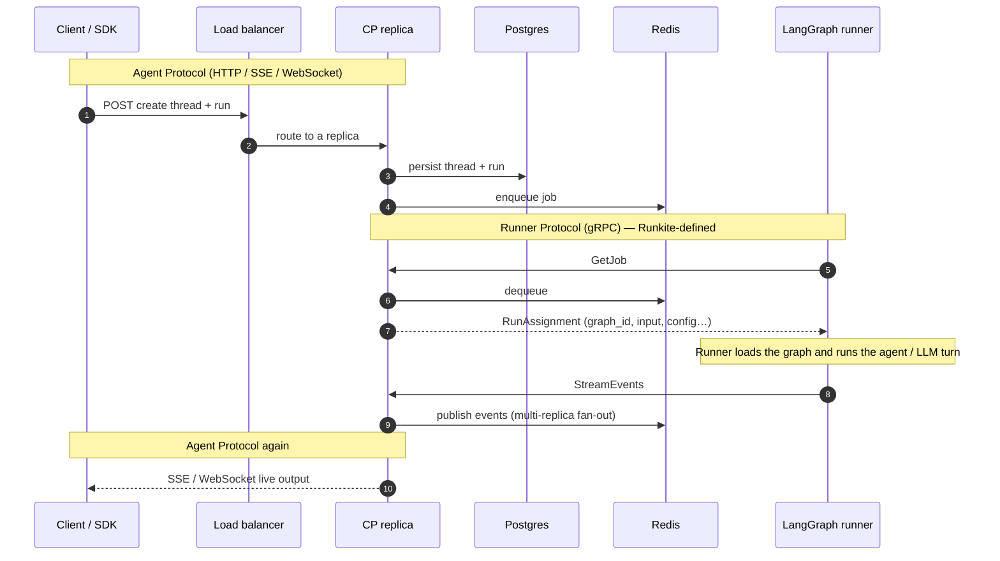
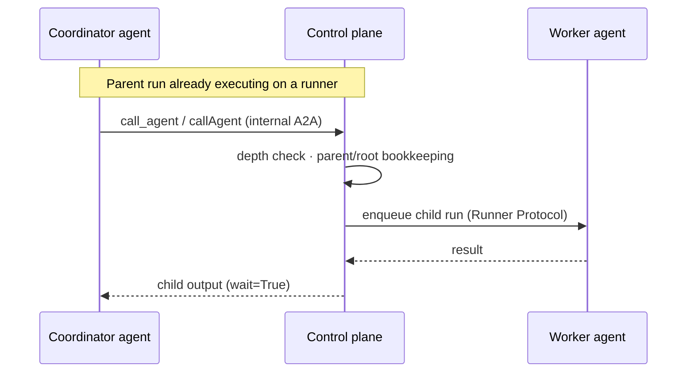

# Runkite

**A self-hosted control plane for AI agents — one Go binary that owns the operational side (auth, dispatch, connectors, human approval, spend, audit) so your agent code can stay a plain LangGraph, CrewAI, LlamaIndex, AutoGen, or LangChain program.**

If you already know [LangSmith Deployments](https://docs.smith.langchain.com/deployment): Runkite is what that would be if it were open source, framework-agnostic instead of LangGraph-only, and shipped as a single binary you run yourself instead of a hosted API you depend on.

[](https://github.com/getrunkite/runkite/actions/workflows/ci.yml?query=branch%3Amain)
[](https://github.com/getrunkite/runkite/actions/workflows/matrix.yml)
[](LICENSE)
[](go.mod)
[](https://pypi.org/project/runkite-runner/)
[](https://www.npmjs.com/package/runkite-runner)
[](https://github.com/getrunkite/runkite/pkgs/container/runkite)
[](https://getrunkite.github.io/runkite/)

**Website:** [getrunkite.github.io/runkite](https://getrunkite.github.io/runkite/) · **Releases:** [GitHub Releases](https://github.com/getrunkite/runkite/releases) · **Python runner:** [PyPI](https://pypi.org/project/runkite-runner/) · **TypeScript runner:** [npm](https://www.npmjs.com/package/runkite-runner)

<p align="center">
  
</p>

<p align="center">
  <b>Admin UI</b> — ops + SQL governance (grants, HITL, kill, audit), embedded in the binary<br/>
  <code>http://localhost:2026/admin/</code> after <code>runkite serve</code> or <code>runkite dev</code>
</p>

---

### Contents

[Why Runkite](#why-runkite) · [What it is not](#what-runkite-is-not) · [Quick start](#quick-start) · [Architecture](#architecture) · [Documentation](#documentation) · [Development](#development) · [License](#license) · [Contributing](#contributing)

---

## Why Runkite

The problem Runkite exists for: one agent, one `.env`, one deploy is easy. A second agent that needs the same GitHub token, a third that needs a human to approve a write before it happens, and someone asking "who called Salesforce last Tuesday" is where most teams end up rebuilding the same operational plumbing — credentials, admission control, crash recovery, kill switches, spend caps, audit — separately, per agent, per framework. Runkite is that plumbing, built once, on a plane your agent code talks to instead of reimplementing.

| Capability | What it means in practice |
|---|---|
| **Agent Protocol, in Go** | HTTP / SSE / WebSocket, auth, streaming, job dispatch, persistence, connectors — one static binary, no runtime dependencies for the control plane itself |
| **Bring your framework** | LangGraph, CrewAI, LlamaIndex, AutoGen, LangChain, and LangGraph.js all attach the same way, over one gRPC Runner Protocol — the plane never special-cases any of them |
| **Governance lives on the plane, not just in the agent** | Fail-closed connector grants, durable policy audit, connector human-in-the-loop approval, kill/pause switches, and time-boxed break-glass bypass — all with their own Admin UI pages, all provable with `make smoke-governance`. Details: [Trust & governance](docs/trust-governance.md) · [Admin UI](docs/admin.md) |
| **Agent-to-agent delegation** | One agent calls another mid-run (`call_agent` / `callAgent`), with depth limits and parent/root bookkeeping enforced by the plane, not left to each agent to get right — [docs/a2a.md](docs/a2a.md) |
| **Ops without a second deploy** | The Admin UI is a React app embedded into the binary via Go's `embed.FS` — there's no separate frontend to host, and no Node.js runtime needed anywhere in production |
| **Spend governance, not a billing platform** | Per-tenant and per-agent daily budgets enforced at admission time, before money is spent — not a dashboard you read the morning after |
| **Honest about backend maturity** | **Supported:** Postgres + Redis HA — this is the profile to run in production today. Also wired and tested, at varying maturity: SQLite, MySQL, MongoDB, NATS, Kafka, and several vector stores. See the real [tier breakdown](docs/architecture.md#backend-support-tiers) rather than a marketing claim that everything is equally production-ready |

## What Runkite is not

Being clear about scope matters as much as being clear about capability:

- **Not another agent framework.** Runkite doesn't tell your agent how to think, plan, or call tools — LangGraph, CrewAI, and the rest still do that. Runkite governs what happens around the agent: dispatch, credentials, approval, spend, audit.
- **Not a managed LLM gateway.** Your agent still calls its model provider directly (or through whatever gateway you already use). Runkite doesn't sit in that request path by default.
- **Not a billing company.** FinOps here means budget caps and an honestly-labeled cost *estimate* enforced on the plane — not invoicing, payment processing, or a Stripe integration.
- **Not (yet) a hosted service.** Self-hosting is what ships today; a fully managed cloud control plane is on the roadmap, not a current substitute for running the binary yourself.

## Quick start

The fastest way to see it working, with nothing installed: [try it on the site](https://getrunkite.github.io/runkite/#try) — `docker compose -f docker-compose.dev.yml up -d --build` brings up the plane, an echo agent shows a full round trip, and a HITL approval demo shows the human-in-the-loop path, all in about five minutes.

To run it directly instead:

| Piece | Get it |
|---|---|
| Control plane | [GitHub Releases](https://github.com/getrunkite/runkite/releases) · `docker pull ghcr.io/getrunkite/runkite:latest` · or `make build` |
| Python runner | `pip install runkite-runner` |
| TypeScript runner | `npm install -g runkite-runner` |
| Helm chart | [`deploy/helm/runkite`](deploy/helm/runkite) |

```bash
git clone https://github.com/getrunkite/runkite && cd runkite && make build

# terminal 1 — zero dependencies (SQLite + in-process transport)
./runkite dev --config examples/echo_agent/langgraph.json

# terminal 2
pip install runkite-runner
runkite-runner --config examples/echo_agent/langgraph.json \
  --grpc-address 127.0.0.1:50051 --http-address http://127.0.0.1:2026
```

Admin: http://localhost:2026/admin/ · Health: http://localhost:2026/health

The full walkthrough — streaming with the client SDK, running against Postgres + Redis instead of the zero-dependency profile, and turning on auth — is in [docs/quickstart.md](docs/quickstart.md) and [docs/client-sdk.md](docs/client-sdk.md). More runnable examples live under [`examples/`](examples/) (`echo_agent`, `approval_agent`, `a2a_agent`, `policy_webhook`, and more).

## Architecture

<p align="center">
  
</p>

<p align="center"><b>Three processes, two protocols</b> — clients speak Agent Protocol to the plane; runners speak Runner Protocol to the plane; the plane owns state, transport, and (optionally) vectors underneath both</p>

The two sequence diagrams below show the same architecture from two different angles: a single run traveling through the high-availability profile, and one agent delegating work to another. Skip this section entirely if you just want to try it — [docs/architecture.md](docs/architecture.md) covers the same ground with the full protocol table and backend tier details.

<details>
<summary><b>One run on the HA profile</b></summary>



</details>

<details>
<summary><b>Agent-to-agent delegation</b></summary>



</details>

## Documentation

| Topic | Links |
|---|---|
| Getting started | [Quick start](docs/quickstart.md) · [Client SDK](docs/client-sdk.md) · [Configuration](docs/configuration.md) · [Auth](docs/auth.md) |
| Core | [Admin UI](docs/admin.md) · [Runners](docs/runners.md) · [Architecture](docs/architecture.md) · [API](docs/api.md) |
| Worker contract (gRPC + opaque checkpoints) | [Runner Protocol](runner-protocol/README.md) · [PROTOCOL.md](runner-protocol/PROTOCOL.md) · [public mirror](https://github.com/getrunkite/runner-protocol) |
| Features | [Connectors](docs/connectors.md) · [A2A](docs/a2a.md) · [MCP](docs/mcp-server.md) · [Registry](docs/registry.md) · [Vectors](docs/vector-store.md) |
| Operations | [Deployment](docs/deployment.md) · [Ops runbook](docs/ops-runbook.md) · [Trust & governance](docs/trust-governance.md) · [Limitations](docs/limitations.md) · [All docs](docs/README.md) |

The [documentation site](https://getrunkite.github.io/runkite/) covers the same material with a guided, page-by-page walkthrough — including a full [Admin UI guide](https://getrunkite.github.io/runkite/support/admin-guide.html) and an occasional [blog post](https://getrunkite.github.io/runkite/support/blog/) — if you'd rather read in that format than jump between Markdown files.

## Development

```bash
make test                 # SQLite + in-memory
make smoke-governance     # governance announce bar (Postgres)
make test-e2e             # black-box binary + runner
```

Full target list, kind/Helm smoke tests, and the nightly matrix: [CONTRIBUTING.md](CONTRIBUTING.md) · [docs/deployment.md](docs/deployment.md).

## License

[Business Source License 1.1](LICENSE). Licensor: **Sharan Harsoor**.

Use, modify, and self-host freely, including in production. You may not offer Runkite as a hosted or managed service to third parties without a commercial license. Each release converts to Apache 2.0 four years after it ships — see `LICENSE` for the exact terms.

## Contributing

See [CONTRIBUTING.md](CONTRIBUTING.md) for how to get set up and what a good PR looks like. Found a security issue? Report it privately per [SECURITY.md](SECURITY.md) — not as a public issue.
