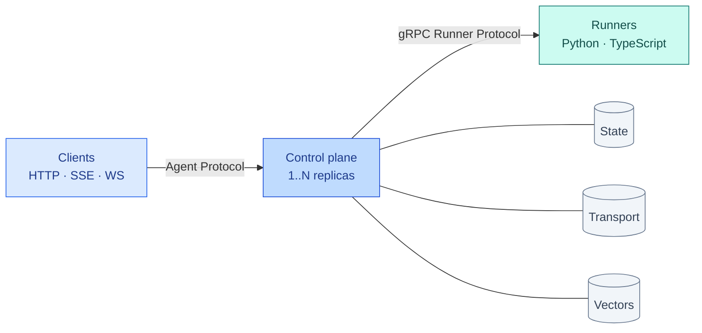
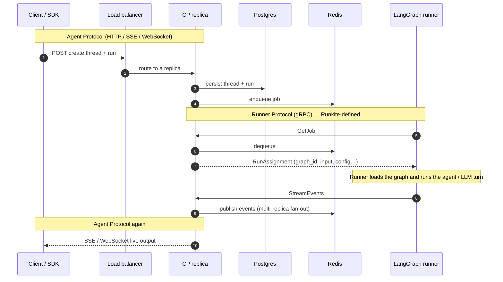
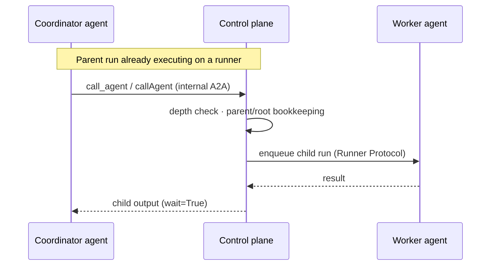

# Runkite

**Self-hosted [Agent Protocol](https://github.com/langchain-ai/agent-protocol) control plane.**  
One Go binary. Framework-agnostic runners. Embedded Admin UI. Pluggable state & transport — Postgres + Redis for HA, with MySQL, MongoDB, NATS, Kafka, and more when you need them.

**Website:** [getrunkite.github.io/runkite](https://getrunkite.github.io/runkite/)

[](https://github.com/getrunkite/runkite/actions/workflows/ci.yml?query=branch%3Amain)
[](https://github.com/getrunkite/runkite/actions/workflows/matrix.yml)
[](LICENSE)
[](go.mod)
[](https://getrunkite.github.io/runkite/)

<p align="center">
  
</p>

<p align="center">
  <b>Admin UI</b> — overview, agents, threads, runs (live SSE), connectors, cron, webhooks<br/>
  Open at <code>http://localhost:2026/admin/</code> after <code>runkite serve</code> or <code>runkite dev</code>
</p>

---

## Why Runkite

| | |
|---|---|
| **Agent Protocol, in Go** | HTTP / SSE / WebSocket, auth, streaming, job dispatch, persistence, connectors — one static binary |
| **Bring your framework** | LangGraph, CrewAI, LlamaIndex, AutoGen, LangChain, LangGraph.js over the same gRPC Runner Protocol |
| **Agent-to-agent delegation** | One agent calls another mid-run (`call_agent` / `callAgent`) — same Agent Protocol path, with depth limits, cancel cascade, and cost rollup |
| **Ops without a second deploy** | React Admin UI embedded via `embed.FS` — no Node runtime for end users |
| **Honest backends** | **Supported:** Postgres + Redis HA. **Also wired:** SQLite, MySQL, MongoDB, NATS, Kafka, pgvector / Qdrant / Weaviate / Pinecone — with documented tiers, not equal claims |

## Architecture



<p align="center">
  
</p>

<p align="center"><b>Catalog of parts</b> — request path on top; state / transport / vectors plug in under the plane</p>

### One run on the HA profile



### Agent Protocol vs Runner Protocol

**Creating threads, posting runs, streaming results** are [Agent Protocol](https://github.com/langchain-ai/agent-protocol) — a public, framework-agnostic client API. The control plane implements that surface.

**Runner Protocol is not that standard.** It is Runkite’s own internal contract ([`runner-protocol/PROTOCOL.md`](runner-protocol/PROTOCOL.md), gRPC in [`proto/runner.proto`](proto/runner.proto)): how the plane hands work to a worker process and how the worker streams events back. Clients never see it. Rough shape:

| Step | Who → whom | What |
|------|------------|------|
| `GetJob` | Runner → plane | Long-poll for the next assignment |
| `RunAssignment` | Plane → runner | `run_id`, `thread_id`, `graph_id`, `input`, `config`, auth context… |
| Execute | Runner only | Load LangGraph / CrewAI / … and run the agent (LLM calls live here) |
| `StreamEvents` | Runner → plane | Progress / messages / values / end |
| Cancel / HITL | Plane ↔ runner | Side channels on the same protocol |

So: Agent Protocol = “what the product client speaks.” Runner Protocol = “what our workers speak.” The plane translates between them, owns Postgres/Redis, and never imports LangGraph itself.

### Agent-to-agent delegation

An agent can call another agent as a sub-task mid-execution — not a separate wire protocol, the same create-run + wait path, reached from inside the runner via `POST /internal/a2a/runs`. Python `call_agent` and TypeScript `callAgent` forward the parent’s auth context; the plane enforces recursion depth, cascades cancel to children, and can roll up cost across the tree.



Example: [`examples/a2a_agent/`](examples/a2a_agent/). Details: [docs/a2a.md](docs/a2a.md).

Backend tiers and HA notes: [docs/architecture.md](docs/architecture.md).

## Quick start

```bash
git clone https://github.com/getrunkite/runkite && cd runkite
make build
```

**Prerequisites:** Go 1.25+, Python 3.12+ (for agents), Docker optional.

**1 — Control plane** (zero-deps: SQLite + in-memory transport)

```bash
./runkite dev --config examples/echo_agent/langgraph.json
```

```
HTTP API:    http://localhost:2026
gRPC bridge: localhost:50051
Admin UI:    http://localhost:2026/admin/
Health:      http://localhost:2026/health
```

**2 — Runner**

```bash
PYTHONPATH=python python -m runkite_runner --config examples/echo_agent/langgraph.json
```

TypeScript / LangGraph.js: see [docs/runners.md](docs/runners.md).

**3 — Create a run**

```python
from langgraph_sdk import get_client

client = get_client(url="http://localhost:2026")
thread = await client.threads.create()
async for event in client.runs.stream(
    thread["thread_id"],
    "echo_agent",
    input={"messages": [{"role": "user", "content": "hello"}]},
):
    print(event.event, event.data)
```

Full walkthrough: [docs/quickstart.md](docs/quickstart.md) · Client access: [docs/client-sdk.md](docs/client-sdk.md)

```
runkite dev             Dev mode (SQLite + in-memory)
runkite serve           Production mode
runkite db upgrade      Migrations
runkite agents list     Agents from config
runkite version         Version info
```

## Backend support tiers

| Tier | Meaning |
|------|---------|
| **Supported** | Multi-replica HA, Helm defaults, primary CI focus |
| **Compatible** | Same conformance suite; known gaps / thinner soak evidence |
| **Experimental** | Single-instance or incomplete multi-replica primitives |

| Concern | Supported | Compatible | Experimental |
|---------|-----------|------------|--------------|
| **State** | **Postgres** | SQLite, MySQL, MongoDB (replica set) | — |
| **Transport** | **Redis** | NATS/JetStream, in-process | Kafka queue without Redis |
| **Mixed** | — | Kafka queue **+ Redis** broker/cancel | — |
| **Vectors** | **pgvector** | Qdrant, Weaviate, Pinecone | — |

Production default: `POSTGRES_DSN` + `REDIS_URL` ([Helm](deploy/helm/runkite), `docker-compose.multi.yml`). Details: [docs/architecture.md](docs/architecture.md).

## Documentation

| | |
|---|---|
| [Quick start](docs/quickstart.md) · [Client SDK](docs/client-sdk.md) · [Configuration](docs/configuration.md) · [Auth / TLS / tenants](docs/auth.md) | Getting started |
| [Admin UI](docs/admin.md) · [Runners](docs/runners.md) · [Architecture](docs/architecture.md) · [API](docs/api.md) | Core |
| [Connectors](docs/connectors.md) · [A2A](docs/a2a.md) · [MCP](docs/mcp-server.md) · [Registry](docs/registry.md) · [Vectors](docs/vector-store.md) | Features |
| [Deployment](docs/deployment.md) · [Factory graphs](docs/factory-graphs.md) · [Limitations](docs/limitations.md) (release summary + deep dive) · [Site](https://getrunkite.github.io/runkite/) · [All docs](docs/README.md) | Ops |

## Examples

| Example | What it proves |
|---------|----------------|
| [`echo_agent`](examples/echo_agent/) | Minimal bridge |
| [`react_agent`](examples/react_agent/) | Tool calls (fake LLM) |
| [`approval_agent`](examples/approval_agent/) | HITL interrupt / resume |
| [`slow_agent`](examples/slow_agent/) | Streaming + cancel |
| [`a2a_agent`](examples/a2a_agent/) | Agent-to-agent delegation |
| [`echo_agent_ts`](examples/echo_agent_ts/) | TypeScript / LangGraph.js |
| [`vector_agent`](examples/vector_agent/) | Vector store |
| [`factory_agent`](examples/factory_agent/) | Per-request factory graphs |
| [`cron_agent`](examples/cron_agent/) · [`store_agent`](examples/store_agent/) · [`custom_routes_agent`](examples/custom_routes_agent/) | Cron, store, custom routes |
| [`gemini/`](examples/gemini/) | Real Gemini agents for every claimed runner (needs `.env.llm`) |

## Development

```bash
make test                    # SQLite + in-memory + protocol fixtures
make test-all                # All backends (needs infra-up)
make test-e2e                # Tier-0 black-box E2E
make test-matrix             # Framework × backend goldens (nightly CI)
make test-protocol-fixtures  # runner-protocol/examples schema + lifecycle
make test-protocol-execute   # execute_run → expected_events goldens (Python)
make test-llm-matrix         # live Gemini N×N (requires gitignored .env.llm)
make infra-up && make build && make lint
```

PR CI: unit / conformance / lint / Tier-0 e2e. Matrix: nightly + `workflow_dispatch`. Guide: [CONTRIBUTING.md](CONTRIBUTING.md) · [docs/deployment.md](docs/deployment.md).

## License

[Business Source License 1.1](LICENSE). Licensor: **Sharan Harsoor**.  
Use, modify, and self-host freely (including production). You may not offer Runkite as a hosted/managed service to third parties without a commercial license. Converts to Apache 2.0 four years after each release — see `LICENSE`.

## Contributing

See [CONTRIBUTING.md](CONTRIBUTING.md). Security issues: [SECURITY.md](SECURITY.md), not a public issue.
