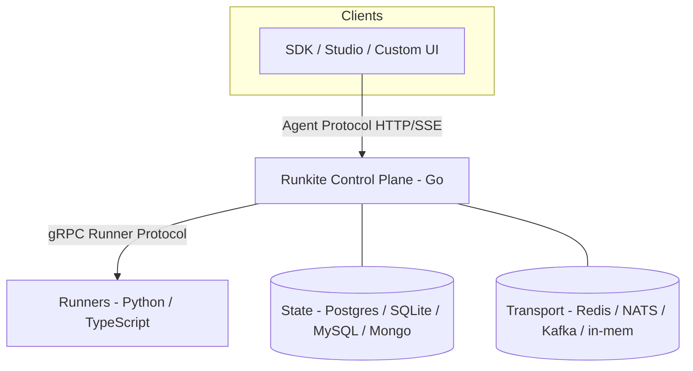
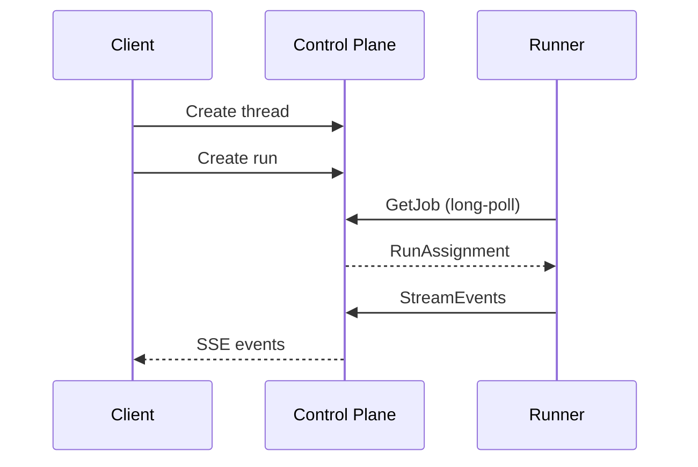
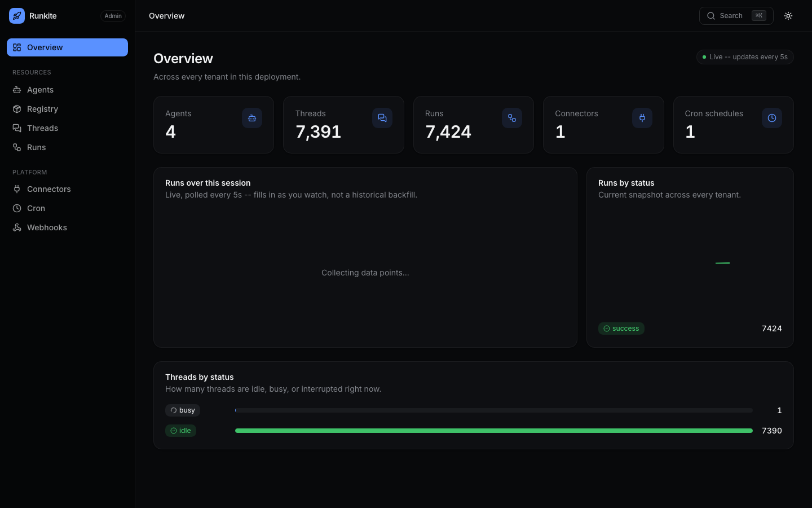
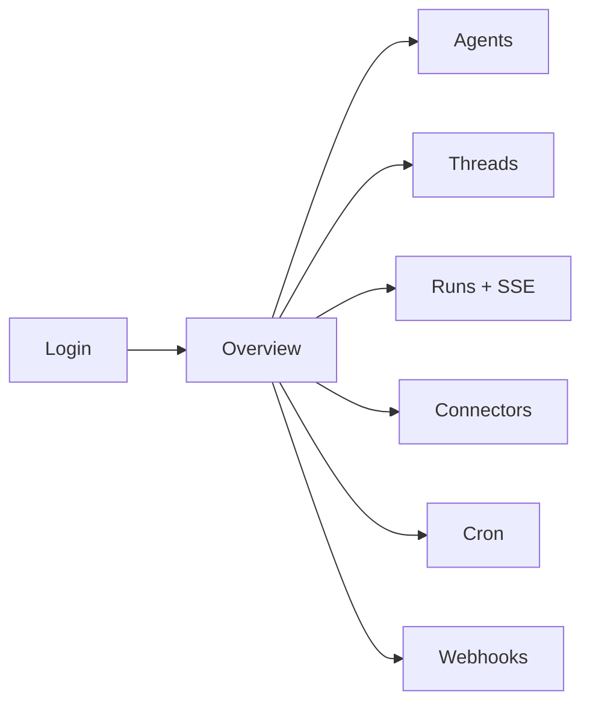

# Runkite

Go control plane for the [Agent Protocol](https://github.com/langchain-ai/agent-protocol) — framework-agnostic runners, embedded Admin UI, Postgres/Redis HA.

[](https://github.com/getrunkite/runkite/actions/workflows/ci.yml)
[](https://github.com/getrunkite/runkite/actions/workflows/matrix.yml)
[](LICENSE)
[](go.mod)

## Why Runkite

- **Agent Protocol control plane in Go** — one static binary owns HTTP/SSE, auth, streaming, job dispatch, state persistence, and connector sessions.
- **Framework-agnostic Runner Protocol** — gRPC pull workers for LangGraph, CrewAI, LlamaIndex, AutoGen, LangChain, and LangGraph.js; agent graphs run unchanged.
- **Embedded Admin UI** — React + TypeScript dashboard baked into the binary via `embed.FS` (no separate Node runtime for end users).
- **Honest production profile** — Postgres + Redis is the Supported multi-replica HA path; other backends are Compatible or Experimental with documented gaps.

## Architecture



The control plane owns the Agent Protocol surface, persistence, and dispatch. Runners own graph execution (`astream()` / LangGraph.js `stream()`).

### Happy path



## Quick Start

```bash
git clone https://github.com/getrunkite/runkite && cd runkite
```

### Prerequisites

- Go 1.25+
- Python 3.12+ (for agents)
- Docker (optional, for Postgres/Redis)

### 1. Build

```bash
make build
```

### 2. Start the control plane

```bash
# Zero-dependency mode: embedded SQLite + in-memory transport
./runkite dev --config examples/echo_agent/langgraph.json
```

Output:

```
  Runkite Control Plane (dev)
  HTTP API:    http://localhost:2026
  gRPC bridge: localhost:50051
  Admin UI:    http://localhost:2026/admin/
  Health:      http://localhost:2026/health
```

### 3. Start a runner

```bash
# Python
PYTHONPATH=python python -m runkite_runner --config examples/echo_agent/langgraph.json

# TypeScript (LangGraph.js) -- see docs/runners.md
cd typescript/runkite-runner && npx tsx src/cli.ts --config ../../examples/echo_agent_ts/langgraph.json
```

### 4. Create a run via SDK

```python
from langgraph_sdk import get_client

client = get_client(url="http://localhost:2026")

# Create a thread and run
thread = await client.threads.create()
async for event in client.runs.stream(
    thread["thread_id"],
    "echo_agent",
    input={"messages": [{"role": "user", "content": "hello"}]},
):
    print(event.event, event.data)
```

Longer walkthrough (custom agent, HITL, auth, connectors, Postgres/Redis): [`docs/quickstart.md`](docs/quickstart.md). Client access notes: [`docs/client-sdk.md`](docs/client-sdk.md).

### CLI (short)

```
runkite dev             Dev mode (SQLite + in-memory, auto-discovers langgraph.json)
runkite serve           Production mode
runkite db upgrade      Run database migrations
runkite agents list     List agents from config
runkite version         Print version info
```

## Admin UI

A web dashboard for operational visibility across every tenant: overview counts, agents, registry, threads, runs (live/replayed SSE), connectors, cron, and webhook dead-letters.



```
runkite serve --config langgraph.json
# -> Admin UI: http://localhost:2026/admin/
```



Requires the `admin` permission when auth is configured (`read`/`write` are not enough). Pure local/dev with no auth skips the login screen. Full route list and operator notes: [docs/admin.md](docs/admin.md).

## Documentation

| Doc | Topic |
|-----|-------|
| [docs/README.md](docs/README.md) | Full docs index |
| [docs/quickstart.md](docs/quickstart.md) | Getting started |
| [docs/client-sdk.md](docs/client-sdk.md) | Client SDK |
| [docs/configuration.md](docs/configuration.md) | `langgraph.json` + env vars |
| [docs/auth.md](docs/auth.md) | Auth, TLS/mTLS, multi-tenancy |
| [docs/admin.md](docs/admin.md) | Admin UI |
| [docs/factory-graphs.md](docs/factory-graphs.md) | Factory graphs |
| [docs/vector-store.md](docs/vector-store.md) | Vector store |
| [docs/connectors.md](docs/connectors.md) | Connectors + custom routes |
| [docs/a2a.md](docs/a2a.md) | Agent-to-Agent |
| [docs/mcp-server.md](docs/mcp-server.md) | MCP server |
| [docs/registry.md](docs/registry.md) | Agent marketplace / registry |
| [docs/architecture.md](docs/architecture.md) | Architecture + dual modes |
| [docs/runners.md](docs/runners.md) | Python / TypeScript runners |
| [docs/deployment.md](docs/deployment.md) | Docker, Helm, development |
| [docs/api.md](docs/api.md) | OpenAPI + API reference |
| [docs/limitations.md](docs/limitations.md) | Known limitations |

## Backend support tiers

Not every pluggable backend is equally battle-tested for multi-replica production. Conformance suites prove the interfaces; tiers tell you what we recommend you run.

| Tier | Meaning |
|------|---------|
| **Supported** | Production profile: multi-replica HA, Helm defaults, primary CI/matrix focus. |
| **Compatible** | Passes the same conformance suite and is wired into `serve`, with known semantic gaps and/or thinner soak evidence. |
| **Experimental** | Works for single-instance / specialized setups; multi-replica HA has residual races or incomplete primitives. |

| Concern | Supported | Compatible | Experimental |
|---------|-----------|------------|--------------|
| **State** | **Postgres** | SQLite (local/dev), MySQL, MongoDB (replica set required) | — |
| **Transport** | **Redis** (full triad) | NATS/JetStream, in-process (single replica) | Kafka queue-only without Redis |
| **Mixed transport** | — | Kafka queue **+ Redis** broker/cancel + reclaim-leader | — |
| **Vector store** | **pgvector** | Qdrant, Weaviate, Pinecone | — |

**Recommended production profile:** `POSTGRES_DSN` + `REDIS_URL`. That is what [`deploy/helm/runkite`](deploy/helm/runkite) and `docker-compose.multi.yml` assume. Details: [docs/architecture.md](docs/architecture.md).

## Examples

| Example | Description |
|---------|-------------|
| `examples/echo_agent/` | Minimal echo agent — proves the bridge |
| `examples/react_agent/` | ReAct agent with tool calls (fake LLM) |
| `examples/approval_agent/` | HITL interrupt/resume |
| `examples/slow_agent/` | Long-running agent for streaming/cancel |
| `examples/all_agents/` | Multi-agent config referencing example graphs |
| `examples/cron_agent/` | Cron-scheduled daily run |
| `examples/store_agent/` | Store dual mode (direct/proxy interop) |
| `examples/custom_routes_agent/` | In-runner FastAPI via `/custom/*` |
| `examples/echo_agent_ts/` | TypeScript / LangGraph.js (echo, slow, approval, factory) |
| `examples/vector_agent/` | Vector store dual mode (fake embeddings) |
| `examples/factory_agent/` | Per-request factory graphs + `runtime.user` |
| `examples/a2a_agent/` | Mid-run agent-to-agent delegation |
| `examples/llm_sim_agent/` | Simulated LLM latency for concurrency benches |

## Development

```bash
make test           # SQLite + in-memory only (no external deps)
make test-all       # All backends (requires infra-up)
make test-e2e       # Tier-0 black-box E2E
make test-python    # Python runner unit tests
make test-ts        # TypeScript runner unit tests
make infra-up       # Ephemeral Postgres + MySQL + Redis + MongoDB + Qdrant
make build          # Build the binary
make lint           # gofmt/vet/golangci-lint + ruff + oxlint/prettier
```

PR CI (`.github/workflows/ci.yml`) runs unit/conformance/lint/Tier-0 e2e on every push. The framework × backend matrix (`.github/workflows/matrix.yml`) runs nightly and on `workflow_dispatch`. Full target list: [docs/deployment.md](docs/deployment.md). Setup and backend contribution guide: [`CONTRIBUTING.md`](CONTRIBUTING.md).

## License

Runkite is licensed under the [Business Source License 1.1](LICENSE).
Licensor / copyright: **Sharan Harsoor** (see `LICENSE` Parameters). You
can use, modify, and self-host it (including in production, including
commercially within your own org) free of charge. The one restriction:
you may not offer Runkite itself as a hosted/managed service to third
parties without a commercial license. Each release converts to
Apache 2.0 four years after publication -- see the `LICENSE` file for the
exact terms.

## Contributing

See [`CONTRIBUTING.md`](CONTRIBUTING.md) for development setup, running tests, and how to add a new state/vector-store backend, runner language, or framework adapter. Found a security issue? See [`SECURITY.md`](SECURITY.md) instead of opening a public issue.
