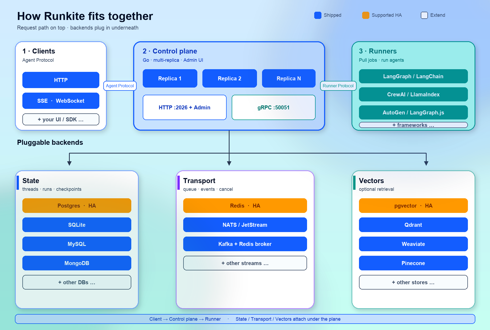
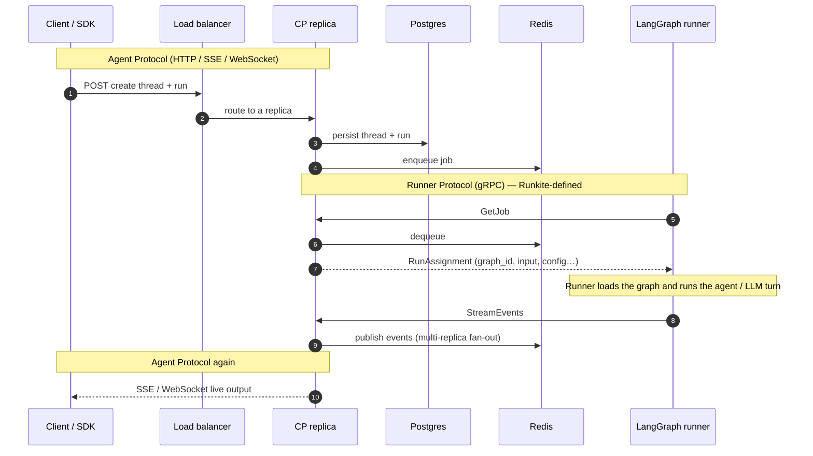
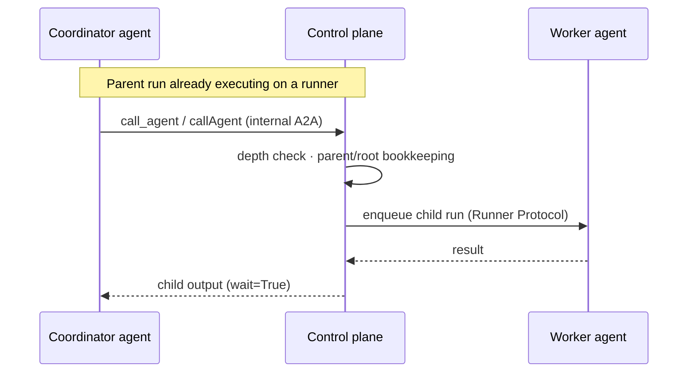

# Runkite

**Runkite is what LangSmith Deployments would be if it were open source, framework-agnostic, and shipped as one Go binary — and then some.**

A self-hosted [Agent Protocol](https://github.com/langchain-ai/agent-protocol) control plane you own — not a LangSmith API clone, not LangGraph-only. Pluggable runners (LangGraph, CrewAI, LlamaIndex, AutoGen, LangChain, LangGraph.js), agent-to-agent delegation, embedded Admin UI, and honest backend tiers beyond a single PG+Redis stack.

**On the plane, not only in the agent:** fail-closed connector grants, durable policy audit, connector HITL, kill/pause, and break-glass on SQL backends — with Admin pages for each. Prove the announce bar with `make smoke-governance`. Details: [Trust & governance](docs/trust-governance.md) · [Admin UI](docs/admin.md).

- Website: https://getrunkite.github.io/runkite/
- Releases / binaries: https://github.com/getrunkite/runkite/releases
- PyPI runner: https://pypi.org/project/runkite-runner/
- npm runner: https://www.npmjs.com/package/runkite-runner

[](https://github.com/getrunkite/runkite/actions/workflows/ci.yml?query=branch%3Amain)
[](https://github.com/getrunkite/runkite/actions/workflows/matrix.yml)
[](LICENSE)
[](go.mod)
[](https://pypi.org/project/runkite-runner/)
[](https://www.npmjs.com/package/runkite-runner)
[](https://github.com/getrunkite/runkite/pkgs/container/runkite)
[](https://getrunkite.github.io/runkite/)

<p align="center">
  
</p>

<p align="center">
  <b>Admin UI</b> — ops + SQL governance (grants, HITL, kill, audit)<br/>
  <code>http://localhost:2026/admin/</code> after <code>runkite serve</code> or <code>runkite dev</code>
</p>

---

## Why Runkite

| | |
|---|---|
| **Agent Protocol, in Go** | HTTP / SSE / WebSocket, auth, streaming, job dispatch, persistence, connectors — one static binary |
| **Bring your framework** | LangGraph, CrewAI, LlamaIndex, AutoGen, LangChain, LangGraph.js over the same gRPC Runner Protocol |
| **Agent-to-agent** | One agent calls another mid-run (`call_agent` / `callAgent`) — [docs/a2a.md](docs/a2a.md) |
| **Ops without a second deploy** | React Admin UI embedded via `embed.FS` — no Node runtime for end users |
| **Plane governance** | Run-bound connectors; grants, HITL, kill, break-glass, audit (SQL). [Trust & governance](docs/trust-governance.md) · `make smoke-governance` |
| **Honest backends** | **Supported:** Postgres + Redis HA. Also wired: SQLite, MySQL, MongoDB, NATS, Kafka, vectors — [tiers](docs/architecture.md#backend-support-tiers) |

## Architecture

<p align="center">
  
</p>

<p align="center"><b>Catalog of parts</b> — Agent Protocol on top; Runner Protocol to workers; state / transport / vectors under the plane</p>

### One run on the HA profile



### Agent-to-agent



Protocol table, backend tiers, dual-mode notes: [docs/architecture.md](docs/architecture.md) · A2A details: [docs/a2a.md](docs/a2a.md).

## Quick start

**Fastest demo (Docker only):** [Try it on the site](https://getrunkite.github.io/runkite/#try) — `docker compose -f docker-compose.dev.yml up -d --build` → echo agent → HITL approve.

| Piece | Get it |
|-------|--------|
| Control plane | [GitHub Releases](https://github.com/getrunkite/runkite/releases) · `docker pull ghcr.io/getrunkite/runkite:latest` · or `make build` |
| Python runner | `pip install runkite-runner` |
| TypeScript runner | `npm install -g runkite-runner` |
| Helm | [`deploy/helm/runkite`](deploy/helm/runkite) |

```bash
git clone https://github.com/getrunkite/runkite && cd runkite && make build

# terminal 1 — zero-deps (SQLite + in-memory)
./runkite dev --config examples/echo_agent/langgraph.json

# terminal 2
pip install runkite-runner
runkite-runner --config examples/echo_agent/langgraph.json \
  --grpc-address 127.0.0.1:50051 --http-address http://127.0.0.1:2026
```

Admin: http://localhost:2026/admin/ · Health: http://localhost:2026/health

Full walkthrough (SDK stream, Postgres/Redis, auth): [docs/quickstart.md](docs/quickstart.md) · [docs/client-sdk.md](docs/client-sdk.md)

## Documentation

| | |
|---|---|
| [Quick start](docs/quickstart.md) · [Client SDK](docs/client-sdk.md) · [Configuration](docs/configuration.md) · [Auth](docs/auth.md) | Getting started |
| [Admin UI](docs/admin.md) · [Runners](docs/runners.md) · [Architecture](docs/architecture.md) · [API](docs/api.md) | Core |
| [Connectors](docs/connectors.md) · [A2A](docs/a2a.md) · [MCP](docs/mcp-server.md) · [Registry](docs/registry.md) · [Vectors](docs/vector-store.md) | Features |
| [Deployment](docs/deployment.md) · [Trust & governance](docs/trust-governance.md) · [Limitations](docs/limitations.md) · [All docs](docs/README.md) | Ops |

Examples under [`examples/`](examples/) (`echo_agent`, `approval_agent`, `a2a_agent`, `policy_webhook`, …).

## Development

```bash
make test                 # SQLite + in-memory
make smoke-governance     # governance announce bar (Postgres)
make test-e2e             # black-box binary + runner
```

Full targets, kind Helm smokes, matrix: [CONTRIBUTING.md](CONTRIBUTING.md) · [docs/deployment.md](docs/deployment.md).

## License

[Business Source License 1.1](LICENSE). Licensor: **Sharan Harsoor**.  
Use, modify, and self-host freely (including production). You may not offer Runkite as a hosted/managed service to third parties without a commercial license. Converts to Apache 2.0 four years after each release — see `LICENSE`.

## Contributing

See [CONTRIBUTING.md](CONTRIBUTING.md). Security issues: [SECURITY.md](SECURITY.md), not a public issue.
