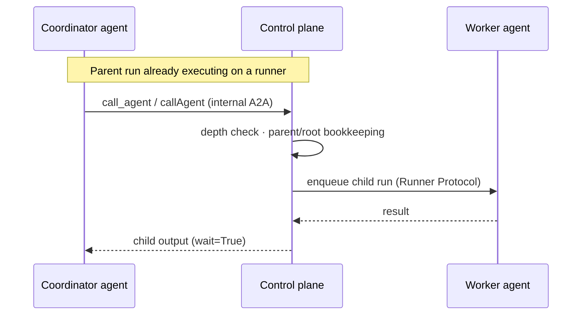

# Agent-to-Agent (A2A)

> Deep dive. Diagram also on the [root README](../README.md#agent-to-agent); protocol path in [architecture.md](architecture.md#agent-protocol-vs-runner-protocol).

An agent calls another agent as a sub-task, mid-execution -- native sub-agent delegation via the same Agent Protocol API. The mechanism is deliberately **not** a new protocol surface -- it's the exact same `POST /threads/{id}/runs` + wait-for-result path any client already uses, just reachable from inside a runner's own process via one new internal route (`POST /internal/a2a/runs`) instead of a public one.



**Python SDK**: `call_agent` (`python/runkite_runner/a2a.py`) is what a node calls, using the exact `config` LangGraph already passes it -- everything needed (the calling run's own `run_id`, the authenticated user to forward) is already there:

```python
from runkite_runner.a2a import call_agent

async def coordinator_node(state, config: RunnableConfig) -> dict:
    result = await call_agent(config, "worker_agent", {"messages": [...]}, wait=True)
    ...
```

**TypeScript SDK**: `callAgent` (`typescript/runkite-runner/src/a2a.ts`) is a direct port -- same request shape, same `config.configurable.run_id`/`langgraph_auth_user` forwarding. The runner's `executeRun.ts` now builds this via an exported `buildRunConfig`, which sets the same `configurable` keys Python's `build_run_config` does (`assistant_id`/`graph_id`/`langgraph_auth_user`/`user_id`/`user_display_name`, not just `thread_id`/`run_id` as before) -- one deliberate difference: the TypeScript version builds a fresh config object rather than mutating `assignment.config` in place, which Python's does (harmless either way; nothing compares object identity):

```typescript
import { callAgent } from "runkite-runner";

async function coordinatorNode(state: State, config: RunnableConfig) {
  const result = await callAgent(config, "worker_agent", { messages: [...] }, { wait: true });
  ...
```

See `examples/a2a_agent/` for a complete working example (`coordinator_agent` delegates to `worker_agent`).

Three things this adds on top of the shared run-creation/wait path:

- **Auth context propagation**: the runner forwards the caller's identity/permissions via `on_behalf_of` (both the Python and TypeScript helpers copy them from the parent run's `langgraph_auth_user`, via each language's own duck-typed `to_dict()`/`toDict()` check). Tenant is derived from the PARENT run's own `tenant_id` (looked up server-side), never trusted from the request body. This is **propagation, not enforcement** -- the control plane does not re-check `on_behalf_of.permissions` against a stored parent-auth record (runs don't persist the original caller's auth), so a buggy or compromised agent/runner could claim higher permissions than the parent run actually had. The trust boundary is "the runner is trusted," same as the rest of `/internal/*`.
- **Recursion limits**: every sub-run's `depth` is enforced against `a2a.max_depth` (default 10) at creation time -- an accidental cycle or runaway delegation chain fails fast with `400`, not a resource leak. Direct children per parent are capped by `a2a.max_breadth` (default 20) so a buggy coordinator cannot fork-bomb the queue in one hop. Configurable:
  ```json
  { "a2a": { "max_depth": 10, "max_breadth": 20 } }
  ```
  `POST /runs/search` accepts `parent_run_id` to list those direct children (same filter the admission check uses).
- **Cost attribution**: every *delegated* run carries `parent_run_id` and `root_run_id` (the top of the chain), persisted and indexed. `RunSearchRequest` exposes `root_run_id` as a client-facing filter (`POST /runs/search`) -- pass the tree's root `run_id` (or any descendant's own `root_run_id` value, which is the same thing) to list every OTHER run in the tree with one query. The root itself is never returned this way (its own `root_run_id` is nil by design; fetch it separately by ID), and this filtered search is subject to the same `maxSearchLimit` (100) clamp as any other client-facing search. `GET /runs/{runID}/cost` (below) is more permissive: pass ANY run's ID in the tree -- root or descendant -- and it resolves to the same root internally before aggregating, no client-side root-finding required.
- **Cancel cascade**: cancelling a run cancels everything it delegated to, directly or transitively (not ancestors or siblings) -- a cancelled parent can't leave orphaned children still executing.
- **Admin visibility**: `GET /admin-api/runs` accepts the same `parent_run_id`/`root_run_id` filters as the client-facing search, and the Admin UI's Run Detail page renders an "Agent-to-agent" panel from them -- a parent link (if this run was delegated) plus a table of direct children (if it delegated to any), with no extra query needed beyond the run's own ID.

**Cost aggregation** (`GET /runs/{runID}/cost`) is deliberately convention-based, not a Runner Protocol change: nothing requires a runner to report token usage today, so this reads whatever a run's own `output` JSON already contains. If it happens to include a top-level `usage` object shaped like most LLM APIs already return it (`prompt_tokens`/`completion_tokens`/`total_tokens`, plus an optional `cost_usd`), it's summed across every run in the tree; a run with no such object just contributes zero. `total_tokens` is filled in as `prompt_tokens + completion_tokens` if a runner reports the two halves but not their sum.

```json
// GET /runs/{any-run-in-the-tree}/cost
{
  "root_run_id": "root-run-id",
  "run_count": 3,
  "usage": {"prompt_tokens": 420, "completion_tokens": 180, "total_tokens": 600, "cost_usd": 0.03},
  "runs": [
    {"run_id": "root-run-id", "agent_id": "coordinator", "depth": 0, "usage": {...}},
    {"run_id": "child-run-id", "agent_id": "worker", "depth": 1, "usage": {...}}
  ]
}
```

**Known limitations, stated plainly**:
- **Concurrency deadlock risk, real and easy to hit**: if the SAME runner process executes both the calling agent and the agent it delegates to, a `wait=True` call blocks that runner's in-flight job slot waiting for a sub-run the same process must dequeue. Default `--concurrency 1` deadlocks on a single hop. **`--concurrency 2` covers one wait-hop**; a deeper wait-chain (A waits on B waits on C) on one process needs roughly `concurrency >= chain_depth + 1`, or another replica of the same `runner_kind`. Horizontally-scaled runner replicas avoid this entirely (any replica can pick up the sub-run).
- **Parent lookup is cross-tenant under runner trust.** `/internal/a2a/runs` resolves `parent_run_id` with system context (no client tenant), then scopes the child to that parent's tenant. A compromised runner that learns another tenant's run UUID could attach a child there -- same "runner is trusted" boundary as other `/internal/*` routes, stated explicitly rather than implied closed.
- **Cost aggregation is best-effort, not authoritative.** It's reading a convention out of existing `output` JSON, not a value the control plane verified or a runner is required to produce -- a misbehaving or silent runner reports zero, not an error.
