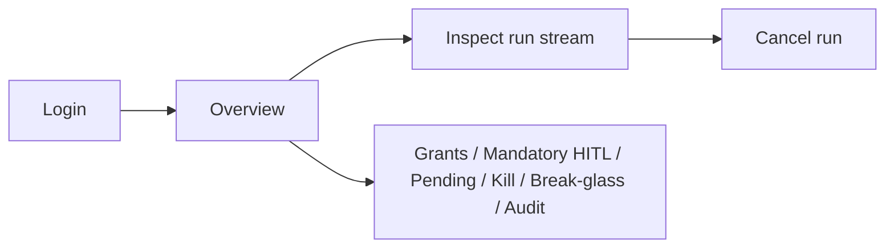

# Admin UI

> Deep dive moved from the root README. For a 60-second overview see the [root README](../README.md).


A web dashboard (React + TypeScript, embedded into the `runkite` binary via Go's `embed.FS` -- no separate deploy step, no Node.js runtime dependency for end users) for operational visibility across every tenant: overview counts, agents, the registry, threads, runs (with a live/replayed SSE event log for debugging a specific run), connectors, cron schedules, and webhook dead-letters — plus SQL governance pages: durable policy grants, mandatory HITL overlays, the connector HITL pending queue, kill/pause switches, break-glass windows, and policy audit search. The walkthrough GIF cycles Overview → Agents → Registry → Threads → Runs → Connectors → Cron → Webhooks → Grants → Mandatory HITL → Pending → Kill → Break-glass → Audit.

```
runkite serve --config langgraph.json
# -> Admin UI: http://localhost:2026/admin/
```

**Scope, stated plainly**: this is the *operational* half of "Admin API + UI" -- it does not include user/API-key management. There's no persisted user table today (`api_key` entries are static `langgraph.json` config, not a DB-backed model); building real user CRUD means building that persistence layer first, which is separate work, not a UI feature bolted onto the existing config.

**Auth**: the dashboard's login screen accepts whatever credential the configured `auth` provider expects (an API key or a JWT) and requires the `admin` permission specifically -- `read`/`write` are not enough, even for viewing the dashboard, since every `/admin-api/*` route sees across every tenant. Empty permissions follow the same `strict_permissions` rules as the rest of the API (fail-closed by default for `api_key`/`jwt`/`webhook`). Optional `auth.admin_keys` are also accepted on `/admin-api/*` only (see [Auth](auth.md)) and fail closed even with no primary provider configured. With **neither** `admin_keys` **nor** a primary `auth` provider configured at all (pure local/dev mode), the dashboard skips the login screen entirely -- there's no credential to log in with, and the API is fully open, same as the client-facing surface in that mode.

The static UI shell (`GET /admin/*`) is always public at the HTTP layer, same as any web app's frontend bundle -- it contains no data, and gating it would make the login page itself unreachable before a credential exists. The actual gate is the JSON API it calls once you sign in:

```
GET /admin-api/overview                     Summary counts (agents/threads/runs, by status) across every tenant -- real COUNT/GROUP BY aggregates, not a capped Search* sample
GET /admin-api/agents                       List agents (tenant_id visible; ?limit=&cursor= or ?offset=, default 50, max 200; X-Next-Cursor)
GET /admin-api/agents/{id}                  Agent detail
GET /admin-api/registry                     List registry entries (tenant_id visible; ?limit=&cursor= or ?offset=; X-Next-Cursor)
GET /admin-api/registry/{name}              Registry entry detail (?tenant_id= disambiguates a cross-tenant name collision)
GET /admin-api/registry/{name}/versions     Registry entry version history (same ?tenant_id=; omitted merges every tenant's history)
GET /admin-api/threads                      List threads (tenant_id visible; ?status=; ?limit=&cursor= or ?offset=; X-Next-Cursor)
GET /admin-api/threads/{id}                 Thread detail
GET /admin-api/threads/{id}/runs            Runs on a thread (?limit=&cursor= or ?offset=; X-Next-Cursor)
GET /admin-api/runs                         List runs (tenant_id visible; ?status=/?agent_id=/?thread_id=; ?limit=&cursor= or ?offset=; X-Next-Cursor)
GET /admin-api/runs/{id}                    Run detail
GET /admin-api/runs/{id}/stream             Live/replayed SSE event log for a run (same mechanics as the client-facing stream)
GET /admin-api/audit-events                 Policy decisions (SQL: Postgres/MySQL/SQLite; ?tenant_id=&decision=&action=&run_id=&agent_id=&connector=&tool=&since=&until= RFC3339; ?limit=&cursor= or ?offset=; X-Next-Cursor). 501 on Mongo.
GET /admin-api/policy-grants                Durable connector grants (SQL; overlays langgraph.json defaults; ?tenant_id=&agent_id=&connector=; ?limit=&cursor= or ?offset=; X-Next-Cursor). 501 on Mongo.
POST /admin-api/policy-grants               Create/upsert a grant; hot-reloads this replica (siblings converge via 15s overlay poll)
GET /admin-api/policy-grants/{id}           Get one grant
PUT /admin-api/policy-grants/{id}           Replace a grant; hot-reloads this replica (siblings via poll)
DELETE /admin-api/policy-grants/{id}        Delete a grant; hot-reloads this replica (siblings via poll)
GET /admin-api/mandatory-hitl               Durable mandatory-HITL overlays (SQL; ?tenant_id=&agent_id=&connector=; X-Next-Cursor). 501 on Mongo.
POST /admin-api/mandatory-hitl              Create/upsert a rule; hot-reloads this replica (siblings via 15s overlay poll)
GET /admin-api/mandatory-hitl/{id}          Get one rule
PUT /admin-api/mandatory-hitl/{id}          Replace a rule; hot-reloads this replica (siblings via poll)
DELETE /admin-api/mandatory-hitl/{id}       Delete a rule; hot-reloads this replica (siblings via poll)
GET /admin-api/pending-actions              Connector HITL queue (SQL; ?tenant_id=&status=&run_id=&connector=; ?limit=&cursor= or ?offset=; X-Next-Cursor). 501 on Mongo.
GET /admin-api/pending-actions/{id}         Get one pending action
POST /admin-api/pending-actions/{id}/approve  Mint one-shot capability for next matching tools/call (refuses if policy hard-denies)
POST /admin-api/pending-actions/{id}/deny   Mark denied
GET /admin-api/kill-switches                Tenant/agent kill or pause flags (SQL; ?tenant_id=&agent_id=; X-Next-Cursor). 501 on Mongo.
POST /admin-api/kill-switches               Upsert kill/pause; unless pause_only, cancel non-terminal runs in scope
GET /admin-api/kill-switches/{id}           Get one kill switch
DELETE /admin-api/kill-switches/{id}        Clear a kill switch (resume enqueue)
GET /admin-api/break-glass                  Time-bounded policy bypass windows (SQL; ?tenant_id=&agent_id=; X-Next-Cursor). 501 on Mongo.
POST /admin-api/break-glass                 Mint window (reason + expires_at required; max 24h; does not bypass kill/authz/limits)
GET /admin-api/break-glass/{id}             Get one window
DELETE /admin-api/break-glass/{id}          Revoke a window (policy Decide applies again)
GET /admin-api/connectors                   Connector status, including circuit breaker state
GET /admin-api/cron                         Cron schedules across every tenant
GET /admin-api/webhooks/dead-letters        Failed webhook deliveries
POST /admin-api/runs/{id}/cancel            Cancel a run (any tenant; reuses client handler under system context)
DELETE /admin-api/threads/{id}              Delete a thread (any tenant)
POST /admin-api/webhooks/dead-letters/{id}/redeliver  Re-POST a dead letter's stored payload (unsigned -- secret isn't persisted)
```

Building the UI from source (only needed if you're changing `admin-ui/` itself -- the built output is committed to `internal/adminui/dist/`, so `go build`/`docker build` never need Node.js):

```bash
cd admin-ui && npm ci && npm run build   # builds straight into internal/adminui/dist/
```

## Governance pages (SQL backends)

| Route | Purpose |
| --- | --- |
| `/admin/grants` | List / create / edit / delete durable `policy-grants` overlays (writer hot-reloads; other replicas poll ≤15s) |
| `/admin/mandatory-hitl` | List / create / edit / delete durable mandatory-HITL overlays (same hot-reload / poll) |
| `/admin/pending` | Connector HITL queue — approve (one-shot capability) or deny |
| `/admin/kill` | Activate / clear tenant or tenant+agent kill or pause (drain pending/running unless pause-only) |
| `/admin/break-glass` | Mint / revoke time-bounded policy bypass (max 24h; kill/authz/limits still apply) |
| `/admin/audit` | Search policy decisions |

Mongo returns `501` on these APIs; the UI empty/error copy calls that out as a SQL requirement.

## Operator flow


