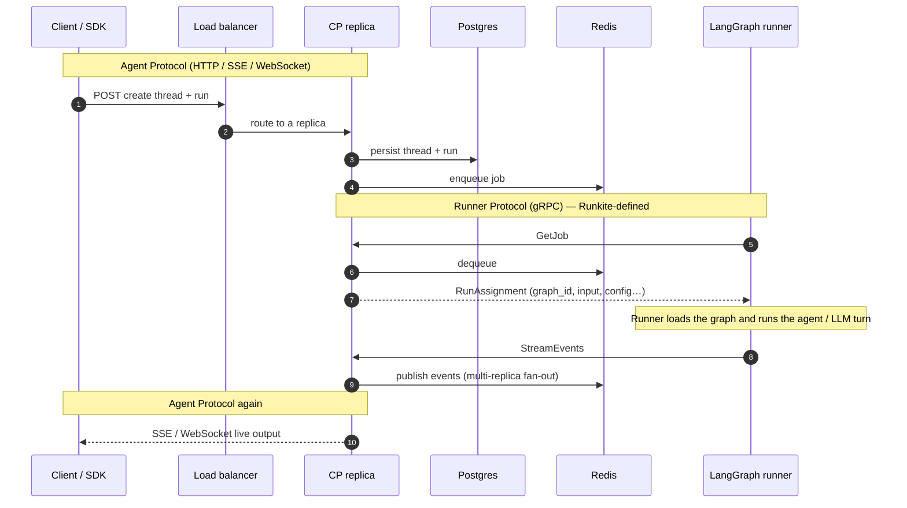

# Architecture

> Deep dive. Diagrams also on the [root README](../README.md#architecture) (ecosystem image, HA run sequence, A2A). Visuals here: [ecosystem.png](assets/ecosystem.png) · Mermaid below.

### One run on the HA profile

### Agent Protocol vs Runner Protocol

**Creating threads, posting runs, streaming results** are [Agent Protocol](https://github.com/langchain-ai/agent-protocol) — a public, framework-agnostic client API. The control plane implements that surface.

**Runner Protocol is not that standard.** It is Runkite’s own worker contract ([`runner-protocol/PROTOCOL.md`](../runner-protocol/PROTOCOL.md), also published at [getrunkite/runner-protocol](https://github.com/getrunkite/runner-protocol); gRPC in [`proto/runner.proto`](../proto/runner.proto)): how the plane hands work to a worker process and how the worker streams events back. Clients never see it.

| Step | Who → whom | What |
|------|------------|------|
| `GetJob` | Runner → plane | Long-poll for the next assignment |
| `RunAssignment` | Plane → runner | `run_id`, `thread_id`, `graph_id`, `input`, `config`, auth context… |
| Execute | Runner only | Load LangGraph / CrewAI / … and run the agent (LLM calls live here) |
| `StreamEvents` | Runner → plane | Progress / messages / values / end |
| Cancel / HITL | Plane ↔ runner | Side channels on the same protocol |

So: Agent Protocol = “what the product client speaks.” Runner Protocol = “what our workers speak.” The plane translates between them, owns Postgres/Redis, and never imports LangGraph itself. Agent-to-agent delegation: [a2a.md](a2a.md).

**Control plane** (Go, single static binary):
- Full Agent Protocol HTTP / SSE / WebSocket surface
- State persistence (SQLite default; Postgres Supported; MySQL/Mongo Compatible)
- Transport layer (in-memory default; Redis Supported; NATS Compatible; Kafka Experimental / Compatible-with-Redis)
- Auth engine (JWT, API key, webhook, plus a separate runner-token tier for the gRPC bridge)
- Connector/MCP registry with run-bound session + MCP proxy
- Plane governance: fail-closed policy grants, durable audit, connector HITL, kill/pause, break-glass, mandatory HITL (SQL durability — see [Trust & governance](trust-governance.md))
- Embedded Admin UI (ops + SQL governance pages — see [Admin UI](admin.md))
- Prometheus metrics (`/metrics`)
- Job dispatch (gRPC long-poll)
- Multi-replica HA when paired with a shared state + transport profile (see tiers below)

**Runner Protocol** (gRPC, versioned):
- Runners pull jobs from the control plane
- Execute agent graphs (LangGraph `astream()` / LangGraph.js `stream()` -- see Runners below)
- Stream events back (values, updates, messages, lifecycle)
- Support interrupt/resume for HITL

### Backend support tiers

Not every pluggable backend is equally battle-tested for multi-replica production. Conformance suites prove the interfaces; tiers tell you what we recommend you run.

| Tier | Meaning |
|------|---------|
| **Supported** | Production profile: multi-replica HA on Postgres + Redis (Compose soak proof), primary CI/matrix focus. Residual gaps, if any, are documented and small. |
| **Compatible** | Passes the same conformance suite and is wired into `serve`, but has known semantic gaps vs Supported, thinner soak evidence, and/or ops caveats — including Helm/Kubernetes (kind K0–K3 ops-proven; no published cloud soak yet — see [k8s-kind-proof.md](k8s-kind-proof.md)). Fine for real use when you accept those gaps. |
| **Experimental** | Works for single-instance / specialized setups; multi-replica or HA behavior has residual races or incomplete primitives. Do not treat as an equal HA alternative to Supported. |

**Recommended production profile:** `POSTGRES_DSN` + `REDIS_URL` (state + full transport triad + shared rate limits + Kafka reclaim leader when Kafka is also used). That is what `docker-compose.multi.yml` soaks and what [`deploy/helm/runkite`](../deploy/helm/runkite) packages as the Supported *backend* overlay — Kubernetes packaging is kind-proven (K0–K3) plus a named EKS smoke/reclaim (K4; see [k8s-kind-proof.md](k8s-kind-proof.md) / [k8s-eks-soak-results.md](k8s-eks-soak-results.md)). Full multi-AZ / multi-hour cloud HA soak is still open — treat production-cloud HA claims cautiously until then.

| Concern | Supported | Compatible | Experimental |
|---------|-----------|------------|--------------|
| **State** (agents/threads/runs/store/cron) | **Postgres** | SQLite (local/dev, single process), MySQL, MongoDB (replica set required) | — |
| **Governance durability** (audit / grants / pending HITL / kill / break-glass / mandatory HITL) | **Postgres** | MySQL, SQLite (same tables); **Mongo: not implemented** (`501` / skip write) — see [Trust & governance](trust-governance.md#governance-durability-sql-backends) | — |
| **Transport** (queue + event broker + cancel) | **Redis** (full triad) | NATS/JetStream (full triad; `EventBroker.Close` is a no-op vs Redis), in-process (single replica only) | Kafka **queue-only** without Redis (no cluster reclaim lock) |
| **Mixed transport** | — | Kafka queue **+ Redis** broker/cancel + Redis reclaim-leader lease | — |
| **Vector store** | **pgvector** (on Supported Postgres) | Qdrant, Weaviate (filter pagination bound), Pinecone | — |

Switch backends by setting `POSTGRES_DSN`, `MYSQL_DSN`, `MONGO_URI`, `REDIS_URL`, `NATS_URL`, and/or `KAFKA_URL`. No code changes. Details and residual-risk notes for each driver live in the sections below (NATS Close gap, Kafka partitions/reclaim, Mongo replica-set requirement, Weaviate filter ceiling, checkpoint direct-mode Postgres-only, etc.).

**Why Postgres + Redis is Supported, not "everything equally":** Postgres is the only state backend with runner **direct-mode** checkpoints/store (`AsyncPostgresSaver` / JS equivalent); every other state backend forces **proxy mode** for that path. Redis is the only transport that pairs cleanly with multi-replica rate limits, shared in-flight reclaim, and the multi-compose topology without extra caveats. MySQL and SQLite share SQL governance tables with Postgres (audit / grants / pending / kill / break-glass / mandatory HITL); Mongo does not. NATS/Qdrant/Weaviate/Pinecone exist to prove the interfaces and serve real deployments that already standardize on them — they are not silently equal to the HA reference profile.

MongoDB (`internal/state/mongo`) is the project's non-SQL exemplar -- proof `state.Store` is implementable against a document store, and a template for community backends. It passes the identical conformance suite Postgres and SQLite do; `UpsertAgent`/`PublishRegistryEntry`/`DeleteRegistryEntry` run inside real Mongo transactions, so the connected Mongo **must be a replica set** (even a single-node one) -- a standalone `mongod` rejects the transaction outright. MySQL (`internal/state/mysql`) is the second SQL exemplar alongside Postgres/SQLite -- same conformance suite, fully wired into `runkite serve`/`db upgrade`/`db downgrade`/`db reset` via `MYSQL_DSN` (Mongo via `MONGO_URI` the same way); DynamoDB remains a documented possible future driver, not built at all.

### NATS transport (JetStream) — Compatible

`internal/transport/nats` is the second full transport implementation (**Compatible** tier -- see [Backend support tiers](#backend-support-tiers)), checked with the exact same `internal/transport/conformance` suite Redis's own transport is (JobQueue, EventBroker, and CancelBroker, all three -- Kafka, added later, deliberately only implements JobQueue; see its own package doc for why NATS specifically earns the full triad and Kafka doesn't). Wired the same way as Redis: set `NATS_URL` (e.g. `nats://localhost:4222`), no code changes.

The queue side genuinely differs from Redis's, not just in wire format: NATS JetStream gives two of this project's own three crash-recovery problems natively -- `AckWait` (a per-message redelivery timer, closing the same gap Redis's hand-built lease-and-reaper closes) and `InProgress` (a heartbeat call that resets that timer without acking, backing `Renew` directly). Fencing is the one piece NOT native, confirmed against a real, still-open NATS issue ([nats-server#4786](https://github.com/nats-io/nats-server/issues/4786)): JetStream currently accepts an ack arriving after a message has already been redelivered to a different consumer -- the exact "stale runner's late report clobbers the current attempt" gap Redis needed generation fencing for. Closed the same way conceptually, but for free where Redis needed a hand-rolled counter: a message's own `NumDelivered` (1 on first delivery, incremented natively by the server on every redelivery) *is* this backend's fencing generation. Shared, cross-replica in-flight tracking (the same requirement the Redis transport uses for multi-replica reclaim) is a JetStream KV bucket holding each in-flight run's reply subject -- a NATS reply subject is just a string, so any control-plane replica holding it can publish an ack/nak/in-progress signal directly, without needing the original connection that received the message.

Passes all 26 conformance tests, but not on the first attempt -- two real, live-found bugs along the way: comparing JetStream sentinel errors with `==` instead of `errors.Is` silently never matched (they come back wrapped), breaking not-found handling in several places at once; and `Replay`'s first implementation reused the same `OrderedConsumer` type `Subscribe` uses for its live tail, which turned out to have self-healing reset/retry logic that doesn't behave well driven by repeated one-shot `FetchNoWait` calls -- it hung retrying an internal consumer reset indefinitely. Fixed by giving `Replay` its own plain ephemeral consumer instead, explicitly deleted when done, with none of `OrderedConsumer`'s continuous-tail machinery to misbehave. Also needed a config-file-only server setting (`max_payload: 8MB` in `deploy/nats-server.conf`, mounted into `docker-compose.test.yml`'s `nats` service): the server's own default (1MB) is smaller than this project's own large-payload conformance test, confirmed live via a genuine "maximum payload exceeded" rejection before the fix.

Known, honest gap versus Redis: `EventBroker.Close` is a documented no-op here, not an "immediately closed channel for a late subscriber" marker the way Redis's `closedKey` gives -- a `Subscribe` call after a run's already-terminal event returns an open channel that silently never receives anything, rather than a channel a caller can distinguish as already-done via a receive-with-ok check. Every current caller already has its own independent terminal-status check against the run's stored state, so this doesn't strand anything in practice, but a future caller relying solely on this channel's own closure to detect "already done" would be wrong to assume parity with Redis here.

### Kafka transport (JobQueue only) — Compatible with Redis; Experimental without

`internal/transport/kafka` is a third `JobQueue` implementation -- deliberately JobQueue-only, not the full triad Redis/NATS give: Kafka has no pub/sub primitive suited to `EventBroker`'s fan-out-plus-replay shape or `CancelBroker`'s fire-and-forget signal, and bolting one on top of Kafka's own log model would mean reinventing a second, unrelated technology rather than using Kafka for what it's good at. Set `KAFKA_URL` (e.g. `localhost:9092`, comma-separated for multiple brokers) to pick Kafka for the queue; pair it with `REDIS_URL` for `EventBroker`/`CancelBroker` (both set = Kafka queue + Redis broker/cancelbus -- **Compatible** HA posture), or leave `REDIS_URL` unset to fall back to the in-process broker/cancelbus (**Experimental** for multi-replica; single-instance only, same caveat the in-process transport always carries). See [Backend support tiers](#backend-support-tiers).

Kafka's own redelivery model is fundamentally different from Redis's and NATS's: it only tracks one committed offset per partition, and committing offset N implicitly commits everything below it too (a documented `segmentio/kafka-go` behavior) -- there's no way to redeliver one specific message out of a partition's sequence via Kafka's own offset mechanism alone. Rather than force a per-message lease onto that model, this backend treats Kafka's own offset commit as a cheap "how far can a fresh consumer skip on restart" hint, not the authoritative record of whether a job is done -- `Dequeue` writes a durable state-topic entry for the job **before** committing its offset (see below for why the order matters), and a separate, single-partition, log-compacted topic (`<namespace>.state`) is the actual source of truth for what's in-flight, its fencing generation, and its full payload for re-delivery. Every control-plane replica tails that compacted topic from its own beginning at startup and keeps an in-memory materialized view (the log is the source of truth, the map is a derived, disposable index any replica can rebuild) -- what makes Ack/Renew/Nack/ReclaimStale usable from any replica regardless of which one's Fetch call actually received a given message, the same "shared, not process-local" requirement the Redis transport uses for multi-replica reclaim. Fencing generation is hand-rolled here too, same reasoning as NATS's own writeup: Kafka's consumer-group generation ID is a group-membership/rebalance concept, not a per-message counter, and using it directly would require staying on the exact connection that fetched a message -- generation instead lives in the state-topic entry, bumped by `ReclaimStale`/`Nack` via a real `json.Unmarshal`/`Marshal` round trip (not string surgery the way Redis's own Lua-side bump needed).

**Multi-replica dequeue needs `KAFKA_JOB_PARTITIONS` (default 1, honestly).** Kafka's consumer-group protocol only ever assigns a given partition to one group member at a time -- with the default of 1 partition per job topic, only ONE control-plane replica actually dequeues a given `runner_kind` at once; other replicas' own `GetJob` calls simply see an empty queue (not an error, and not a correctness gap -- Ack/Renew/Nack still work from any replica via the shared state topic) until Kafka rebalances the partition to them, e.g. if the currently-assigned replica dies. Set `KAFKA_JOB_PARTITIONS` (wired to `kafkatransport.WithJobPartitions`) to more than 1, matching or exceeding your replica count, for genuine concurrent multi-replica dequeue throughput -- confirmed live: a fresh job topic created with `WithJobPartitions(3)` reports `PartitionCount: 3` via `kafka-topics.sh --describe`. Only takes effect the first time a job topic is created; an already-existing topic's partition count doesn't change retroactively, so set this consistently across every replica sharing a cluster.

**Reclaim under multi-replica Kafka:** Kafka alone has no compare-and-swap for `ReclaimStale` (a state-topic produce is last-write-wins), so two reaper ticks racing the same stale `run_id` could both re-produce it. The supported HA posture is `KAFKA_URL` + `REDIS_URL`: a Redis reclaim-leader lease (`rk:reclaim-leader`) ensures only one control-plane replica runs `ReclaimStale` per tick. The lease is acquired/renewed atomically (Lua: if unlocked or still ours, `SET` with TTL; else leave alone) so a live leader keeps the lock continuously across the 2s ticker without the ~1s unheld gap a blind `SET NX` left when TTL (3s) outlived a tick. Kafka without Redis falls back to the in-process broker/cancelbus and has no cluster-wide reclaim lock -- treat that as single-instance / experimental for multi-replica; agent tools should still be idempotent. Confirmed live (killing a runner mid-`slow_agent` against a real Kafka broker, Postgres, and Redis): the reaper reclaimed the stale job (`reclaimed stale jobs count=1 max_age=6s`) and a second runner completed it successfully.

Passes all 15+ conformance tests, live-verified end-to-end, but real bugs surfaced along the way at every review pass, all confirmed against a real single-node KRaft broker, not assumed: (1) `ReclaimStale`/`Nack` were re-producing a job's original, unmodified bytes -- since Kafka (unlike Redis/NATS) has no native redelivery counter, a job's own embedded `generation` field is what `Dequeue` trusts, and re-producing without updating it meant every redelivery silently looked like generation 1 again, defeating fencing entirely; fixed by unmarshaling, bumping, and re-marshaling the payload before every re-produce. (2) The consumer-group id was scoped only by `runner_kind`, not also by this backend's own topic namespace -- two independent `Queue`s pointed at the same broker with different namespaces but the same literal `runner_kind` string collided on group membership, corrupting each other's offsets; fixed by folding the namespace into the group id too. (3) `kafka-go`'s default `Writer`/`Reader` both cap message size at 1MB independent of the broker's own `message.max.bytes`, silently rejecting or truncating this project's own large-payload conformance test until raised explicitly (`BatchBytes`/`MaxBytes`, 8MB, matching NATS's own `max_payload` fix). (4) A closer external review caught `Dequeue` committing a message's offset *before* writing its state-topic entry -- if the process died or that write failed in between, the job was neither Kafka-redeliverable (offset already committed) nor reclaimable (no state entry), silently lost for good; fixed by reordering so the state write happens first, so a failure in that window instead leaves the message uncommitted and redeliverable to a fresh consumer session, trading a small duplicate-delivery risk for eliminating the lost-job risk. (5) The same review caught `Len` deduplicating `ReadPartitions`' results by topic name and always reading partition 0, silently undercounting once `KAFKA_JOB_PARTITIONS` (see above) was raised above 1 -- fixed to sum lag across every partition.

Two further live-confirmed characteristics, not bugs: **cold start.** A brand-new Kafka cluster's very first consumer group anywhere forces the broker to lazily create its own internal `__consumer_offsets` topic (50 partitions by default), which took long enough in testing to miss a 5s `Dequeue` timeout on the very first call against a truly virgin broker -- a real, one-time, whole-cluster cost (not per-`runner_kind`), and in practice already paid by any long-running production Kafka cluster before Runkite ever connects; deliberately not papered over with a blocking warm-up inside `NewQueue` itself, since the only way to force it early is to wait on an empty topic until timeout, taxing every construction rather than just the first. **Per-consumer-group-lifecycle overhead.** This package's own conformance suite is meaningfully slower than Redis's or NATS's (`make test-kafka` takes ~3 minutes vs seconds) -- each of its ~15 sub-tests joins and leaves its own fresh, uniquely-namespaced consumer group (needed for test isolation, since Kafka has no cheap "wipe everything" primitive the way Redis's `FLUSHALL` or NATS KV bucket deletion do), and that join/leave protocol exchange itself, not this project's own code, is what's slow.

### Checkpoint dual mode

Agent graph checkpoints and control-plane run/thread metadata are **intentionally different stores** -- not two writers fighting the same row. Confusion here is an ops footgun, not a split-brain bug.

| Layer | Where it lives | Who writes it |
|-------|----------------|---------------|
| Control-plane runs/threads/`thread_checkpoints` | State backend (Postgres / MySQL / Mongo / SQLite) | Control plane |
| LangGraph graph checkpoints | LangGraph's own Postgres tables (`checkpoints`, `checkpoint_blobs`, `checkpoint_writes`) | Runner, **only** in direct mode |

**Runner modes** (Python / TypeScript):

- **Direct mode** (`POSTGRES_DSN` set on the runner): LangGraph writes its own Postgres tables via `AsyncPostgresSaver` / JS equivalent. Correct only when the control plane also uses `POSTGRES_DSN` against **the same database** (Supported profile). Thread state survives a runner restart.
- **Proxy mode** (`POSTGRES_DSN` unset, `RUNKITE_HTTP_URL` set): LangGraph uses `ProxyCheckpointSaver`, which stores **opaque blobs** on the control plane via `/internal/checkpoints/*`. Works against **any** CP state backend (SQLite / MySQL / Mongo / Postgres). Survives runner restart without giving the runner DB credentials. Non-LangGraph adapters reuse the same `/internal/checkpoints` API with a stable `adapter-state` id for message continuity across runs (not LangGraph HITL fidelity) — see Runner Protocol §6.5.
- **In-memory fallback** (neither DSN nor HTTP URL): LangGraph's `MemorySaver`. Explicitly ephemeral — fine for local/dev; does **not** survive a runner restart.

**HITL / mid-superstep fidelity (proxy):** full LangGraph interrupt→resume and pending writes, not a half-promise. `ProxyCheckpointSaver` packs `checkpoint` + `metadata` + `writes` (pending channel writes from `aput_writes` / `putWrites`) into each opaque blob; `aput`/`put` preserves existing `writes`; concurrent writers merge via If-Match / ETag CAS (no silent drop). A GET 200 without ETag refuses the update rather than issuing an unconditional PUT. `aput_writes`/`putWrites` without `checkpoint_id` raises. Pregel calls writes before put for a new id — both paths treat a missing blob as create-only (`If-None-Match: *`): writes insert a shell, put inserts the full checkpoint; if a peer already won, `412` → GET+merge so an unconditional put cannot wipe a shell. Late writes after cancel/reclaim soft-no-op on `403 run_not_inflight` (must not crash the Node runner). Unsupported paths fail loud (`alist(filter=...)` / `list({filter})`). **Not cross-language resume:** envelope `v`/field layout matches across Python and TypeScript, but `dumps_typed` payloads are runtime-specific — do not hand a TS-written thread to a Python runner (or the reverse). Proven by `python/tests/test_proxy_checkpoint.py`, `typescript/runkite-runner` `proxyCheckpoint` tests, and matrix `hitl_restart` (interrupt → kill runner → resume) on SQLite and MySQL CP with blank runner `POSTGRES_DSN` for both `python-langgraph` and `typescript-langgraphjs`.

**MySQL / Mongo / SQLite control planes:** unset `POSTGRES_DSN` on runners and set `RUNKITE_HTTP_URL` so checkpoints (and store) use **proxy mode**. Do not leave `POSTGRES_DSN` pointed at a separate Postgres or you silently split state. Direct-mode LangGraph tables remain Postgres-only; proxy mode is the durable path for every other CP backend.

**Retention:** `retention.checkpoints_keep_last` prunes runkite's Agent Protocol `thread_checkpoints` **and** opaque proxy blobs (`opaque_checkpoints`). It never touches LangGraph's direct-mode Postgres tables — see Retention below. `serve` warns when that retention knob is enabled.

**Crash recovery covers a job's WHOLE execution, not just its start.** The control plane tracks every dequeued job as in-flight, and an unacked job past a short max-age (6s) is automatically reclaimed and redelivered to a live runner. This closes two windows, not one: the "zombie GetJob" case (a runner dying between `GetJob` and actually starting work -- via gRPC keepalive detecting the dead connection in ~4s plus a same-instant `ctx.Err()` check in `GetJob`), and a runner dying *during* execution, at any point, via a periodic **Heartbeat** RPC the runner calls every ~2s for the whole duration of a run, extending the same in-flight lease. Both are the same underlying mechanism (a Redis-backed lease with a reclaim reaper), not two separate systems -- the runner just keeps resetting the clock throughout execution instead of only once at the start.

This closed a real, previously-shipped gap, found and fixed the honest way: live multi-instance testing first found that a runner killed immediately after emitting its first event left the run permanently stuck (nothing was watching it past that point -- only the delivery, not the whole execution, was covered). Rather than paper over it, that finding was published as a Known Limitation and fixed properly. Live-verified after the fix, via a Redis `MONITOR` trace during a real run: `HSET`/`ZADD` at dequeue, a first renewal ~6ms later (the runner's first `StreamEvents` message), then renewals every ~2.0s for the run's whole duration, and a final `HDEL`/`ZREM` only once the run actually completes. Then verified the actual recovery, not just the renewal mechanism: dispatched a 3-step, 6-second run, killed the runner mid-second-step (a scenario that previously left the run permanently `"status":"pending"` / thread `"status":"busy"` forever) -- a surviving control-plane replica's reaper reclaimed the job ~8s later (`"reclaimed stale jobs" count=1`), a live runner picked it up in the same instant, and the run reached `"status":"success"` with the thread back to `"idle"`, no manual intervention.

With the Redis transport, in-flight tracking lives in Redis itself, not in any one control-plane process's memory -- so it's correctly shared across a multi-node control plane, also verified live via the same `MONITOR` trace: the `HSET`/`ZADD` recording a job in-flight came from one control-plane replica's IP, and later renewals came from other replicas' IPs -- cross-instance sharing under nginx's round-robin, confirmed on the wire. Claiming a job off the ready queue is atomic via `BLMOVE` onto `rk:inflight:pending`, then a Lua promote into the durable inflight hash/zset -- a process crash between those steps leaves the job on pending (recovered by the reaper's drain), never silently lost the way the old `BRPOP` then separate `HSET`/`ZADD` path could. The in-process (zero-dependency, single-instance) transport is, as its name says, still local to that one process by design.

**Fencing closes the last edge case: a reclaimed job's original runner finishing late anyway.** A rarer race than a real crash -- a runner has a transient network blip, misses enough heartbeats for the reaper to reclaim and redispatch its job to a second runner, but the *original* runner's blip was temporary and it finishes execution anyway, trying to report a result after a second runner already took over. A generation token (`RunAssignment.Generation`, bumped every time `ReclaimStale` reclaims a job) closes this: `Heartbeat` and `ReportStatus` both carry the generation the runner was actually dispatched with, and the control plane rejects either call if it's stale. Crucially, `Heartbeat` is where a stale runner actually *learns* it's superseded and can act on it -- every ~2s throughout its (now pointless) execution, not only once it eventually finishes -- so it stops cooperatively (the exact same cancellation path a real cancel signal uses) instead of wasting the rest of a run nobody wants.

Live-verified end to end on the real multi-instance topology: dispatched a `slow_agent` run, `docker pause`d the runner that dequeued it (freezing it mid-execution, not killing it); a surviving replica's reaper reclaimed the job (`"reclaimed stale jobs" count=1`) and a second runner completed it `status=success`. `docker unpause`d the first runner -- it resumed unaware it had been reclaimed, and its very next heartbeat came back superseded (`"heartbeat superseded, signaling runner to stop"`); the runner stopped and reported `status=interrupted`, but that report was itself rejected (`"ignored superseded status report"`) rather than overwriting the real outcome. The run's final status stayed `"success"` from the runner that actually earned it, and the thread ended `"idle"`, not stuck.

A stale runner's terminal ("end") event is also filtered before it ever reaches a subscriber, not just its final status report -- otherwise a client long-polling for this run's result (or watching it live over SSE) could observe the stale runner's own spurious outcome before the real one arrives. Only terminal events are checked this way; ordinary progress events are not, since nothing treats them as authoritative the way a run's final status is.

### Store dual mode

The unified KV store (`/store/*`) is also usable directly from agent code, not just via raw HTTP: `RunkiteStore` (`python/runkite_runner/store.py`) implements LangGraph's `BaseStore` interface and is attached to every loaded graph automatically, so any node using the standard `get_store()` injection (`store.put(...)`, `store.get(...)`) just works -- no agent-code changes needed.

- **Direct mode** (when `POSTGRES_DSN` is set): queries the control plane's own `store_items` table straight over `psycopg`, using the identical `\x1F`-delimited namespace encoding the Go control plane uses. Zero HTTP hop.
- **Proxy mode** (no `POSTGRES_DSN`): calls the control plane's `/store/*` HTTP API over `httpx`.

Both modes read and write the exact same rows -- a value written by one Python runner in direct mode is immediately visible to another runner in proxy mode, and to any HTTP client. Verified end-to-end: a direct-mode runner increments a cross-thread counter via `store.put`, the runner is killed, a fresh proxy-mode runner picks up the next run and reads/increments the same counter through HTTP.

**TTL**: `RunkiteStore` sets `supports_ttl = True` and implements LangGraph's `BaseStore` TTL contract in full (real gap found live: a framework calling `store.aput(..., ttl=...)` used to hard-fail with `NotImplementedError: TTL is not supported by RunkiteStore`) -- `store.put(ns, key, value, ttl=<minutes>)` expires the item that many minutes after it was last accessed, `ttl=None` means no expiration, and reads (`get`/`search`) refresh the expiry by default (`refresh_ttl=False` opts out per-call). Backed by `ttl_minutes`/`expires_at` columns on `store_items`, supported identically across SQLite, Postgres, and MongoDB, and in both direct and proxy mode. Expired items read as absent (no special error) and are swept by a background job that runs regardless of the `retention` config below, since it's hygiene for an already-excluded-from-reads state, not a configurable retention policy. The TypeScript runner's `RunkiteStore` does not implement TTL -- not a gap, `@langchain/langgraph-checkpoint`'s `BaseStore` has no TTL concept in the JS ecosystem at all as of the installed version.
